# Generating Handwritten Text with *pywritesmooth*

Generate or smooth handwritten text using a Python command line application.

## Summary
This package began life as the capstone project for a data science Master's program.  With its potential to help people suffering from dysgraphia and other disorders that affect handwriting, the entire project is now open source under an MIT license.  In addition to helping with handwriting by using the application, the project is also well-documented and designed in a way to let students of data science benefit from its study.

The work here is based on a paper by Alex Graves, [Generating Sequences with Recurrent Neural Networks](https://arxiv.org/pdf/1308.0850), which is it highly recommended you read before continuing on.  In particular, much of the application comes from section 5 of that paper.  In addition, some of the modeling code was adapted from the great code of [adeboissiere](https://github.com/adeboissiere/Handwriting-Prediction-and-Synthesis) and is noted as such in the source.

The basic idea, with minimal math, is that you can generate handwriting by considering each stroke to be comprised of a series of *(x,y)* coordinate points on a Cartesian grid.  The approach is statistical.  We train a model - in our case, a neural network - to find the distribution of possible points that follow the most recent series of points.  The most likely part of that distribution is then selected for the next point.  Similarly, a distribution is also created to determine the likelihood that the next point is the last point of a stroke, i.e. that the virtual pen is lifted from the paper before starting the next stroke in another position.

Continue reading to learn how to:
* Use the command line application
* Learn about the DevOps process
* Study the application design
* Understand more deeply the algorithms and mathematics behind the code

## Usage
This is a Python application, and it has been written to support a variety of usage scenarios.  The simplest is to just install it and use it.  At this time, it only supports a command line interface.  To install, first install a Python distribution, such as [Anaconda](https://docs.anaconda.com/anaconda/install/).   Open a PowerShell prompt on Windows or a terminal on Linux or Mac and type:

	pip install pywritesmooth

To execute, type:

	pywritesmooth [OPTIONS]
		-or-
	python pywritesmooth.py [OPTIONS]

### All Options
Here is a complete list of options for reference.

|Short Form|Long Form|Description|
|:---|:---:|:---|
|-e|--epoch|Number of epochs to run when training; default 10|
|-gs|--generated-save|To save or not to save.. the generated strokes (of which there could be a ton)|
|-hs|--handwriting-save|To save or not to save.. the samples (of which there could be a ton)|
|-hws|--hw-save|Location to save handwriting images; file name given will have numbers appended, i.e. images\hw will become images\hw1.png, hw2.png, etc.|
|-id|--image-display|To display or not to display.. the plots|
|-is|--image-save|Location to save plot images; file name given will have numbers appended, i.e. images\phi will become images\phi1.png, phi2.png, etc.|
|-l|--log-file|Filename of the log file|
|-ll|--log-level|Logging level: critical, error, warning, info, or debug|
|-m|--saved-model|Filename of a HandwritingSynthesisModel for saving/loading|
|-p|--pickled-data|Filename of a StrokeDataset for saving/loading in Python pickle format|
|-s|--smooth|Flag to try smoothing a sample; requires smooth-model and smooth-sample|
|-sm|--smooth-model|Preferred smoothing model, option is only LSTM|
|-ss|--smooth-sample|Filename of a writing sample in online (XML) format similar to the structure of the IAM dataset|
|-t|--train|Folder that contains stroke file(s) of handwriting in online format to train the model(s)|
|-tsm|--test-model|Flag if you want to automatically run the handwriting generation tests, which will save as svg files|
|-tm|--train-models|Models to be trained, option is only LSTM|
|-w|--write|Generate handwriting from a text string: max of 80 chars|

### Data Options
When loading data, you can either load it from a dataset on disk to train (see Training section), or, if that process has already been executed, you can specify the resulting file to be loaded.  The advantage of doing so is that loading the *'pickle'* file takes a few seconds, whereas initially loading the data from a dataset of strokes files can take hours.  If you do need to train data, the data needs to be in a format and file/folder naming scheme similar to that of the [IAM Online Database](https://fki.tic.heia-fr.ch/databases/iam-on-line-handwriting-database).

Additionally, robust logging has been included for the purposes of understanding the code and diagnosing issues during development.  There are two components to set, a filename for the log file and a logging level.  The default level is *info*; however, you can set the level to be, in decreasing severity, of *critical*, *error*, *warning*, *info*, or *debug*.  Fair warning: the *debug* level will generate a **lot** of logging.  The logger will automatically round-robin the files, where each file can be a maximum of 100MB, and up to 50 files will be created before the oldest is overwritten.  This constrains the log files to a reasonable amount of disk space.

|Short Form|Long Form|Description|
|:---|:---:|:---|
|-l|--log-file|Filename of the log file|
|-ll|--log-level|Logging level: critical, error, warning, info, or debug|
|-p|--pickled-data|Filename of a StrokeDataset for saving/loading in Python pickle format|
|-t|--train|Folder that contains stroke file(s) of handwriting in online format to train the model(s)|

#### Examples
```powershell
pywritesmooth -p ".\saves\hwData.pkl" -l ".\logs\pywritesmooth.log" -ll "debug"
pywritesmooth -t "C:\Data\IAM Original\lineStrokes-all\lineStrokes" --train-models=lstm -p ".\saves\hwData.pkl" -l ".\logs\pywritesmooth.log" -ll "info"
```

### Training Options
In order to smooth or generate handwriting, a model must be trained.  These options support the training activity.

As discussed in the Data section, input data must be in the format of the [IAM Online Database](https://fki.tic.heia-fr.ch/databases/iam-on-line-handwriting-database) or given a presaved Python *pickle* file of the dataset.  To train, the *--train* option must be specified, which will tell the program to train a model.  In addition, specify the model to be trained (currently, only *lstm* is supported), and you can optionally specify a file to save the trained model to.  If you do save the trained model, you can load the model from that file in the future, saving hours or even days of training time depending on the size of the dataset and the depth of training.

Key hyper-parameters, such as the number of epochs, can be set.  During training, the entire dataset is divided into batches, and one epoch represents the training of all batches one time.  More epochs result in greater training accuracy.

There are also a number of options to monitor and understand the training.  For instance, you can have the program automatically test a trained model at the end, which will generate some test handwriting.  You can also display any plots interactively (good for a small dataset) or saved (preferred for large datasets).  In addition, as the training progresses, you can have the program periodically save a sample of generated writing to see how the training of the model progresses.  The relevant parameters let you specify path and file names for these images.

|Short Form|Long Form|Description|
|:---|:---:|:---|
|-e|--epoch|Number of epochs to run when training; default 10|
|-gs|--generated-save|To save or not to save.. the generated strokes (of which there could be a ton)|
|-hws|--hw-save|Location to save handwriting images; file name given will have numbers appended, i.e. images\hw will become images\hw1.png, hw2.png, etc.|
|-id|--image-display|To display or not to display.. the plots|
|-is|--image-save|Location to save plot images; file name given will have numbers appended, i.e. images\phi will become images\phi1.png, phi2.png, etc.|
|-m|--saved-model|Filename of a HandwritingSynthesisModel for saving/loading|
|-t|--train|Folder that contains stroke file(s) of handwriting in online format to train the model(s)|
|-tsm|--test-model|Flag if you want to automatically run the handwriting generation tests, which will save as svg files|
|-tm|--train-models|Models to be trained, option is only LSTM|

#### Examples
```powershell
pywritesmooth -t "C:\Data\IAM Original\lineStrokes-all\lineStrokes" --train-models=lstm -m ".\saves\hwSynthesis.model"
pywritesmooth -t "C:\Data\IAM Original\lineStrokes-all\lineStrokes" --train-models=lstm -m ".\saves\hwSynthesis.model" -p ".\saves\hwData.pkl"
pywritesmooth -t "C:\Data\IAM Original\lineStrokes-all\lineStrokes" --train-models=lstm -m ".\saves\hwSynthesis.model" -p ".\saves\hwData.pkl" -l ".\logs\pywritesmooth.log" -ll "warning"
pywritesmooth -t "C:\Data\IAM Original\lineStrokes-all\lineStrokes" --train-models=lstm -m ".\saves\hwSynthesis.model" -p ".\saves\hwData.pkl" -l ".\logs\pywritesmooth.log" -ll "error" -is ".\plots\heatmap" -hws ".\samples\hw" -gs -tm
pywritesmooth -t "C:\Data\IAM Original\lineStrokes-all\lineStrokes" --train-models=lstm -m ".\saves\hwSynthesis.model" -is ".\plots\heatmap" -hws ".\samples\hw" -gs -tm
```

### Generation Options
Once trained, you can use the resulting model to generate arbitrary text of up to 80 characters or smooth handwriting that is provided in the same format as the original training dataset.  You can either train the model first or simply load an already-trained model (preferred and much faster) using the *--smooth-model* parameter.  A trained model is required for any writing generation.

You specify a string for generation with *--write* followed by the string.  The resulting handwriting is saved in SVG format to the file specified.

You specify a sample for smoothing by first turning on smoothing with *--smooth*, selecting your preferred smoothing model (which is currently only implemented in LSTM), and given the filename of the sample.  Images will be saved where specified.

|Short Form|Long Form|Description|
|:---|:---:|:---|
|-hws|--hw-save|Location to save handwriting images; file name given will have numbers appended, i.e. images\hw will become images\hw1.png, hw2.png, etc.|
|-m|--saved-model|Filename of a HandwritingSynthesisModel for saving/loading|
|-s|--smooth|Flag to try smoothing a sample; requires smooth-model and smooth-sample|
|-sm|--smooth-model|Preferred smoothing model, option is only LSTM|
|-ss|--smooth-sample|Filename of a writing sample in online (XML) format similar to the structure of the IAM dataset|
|-w|--write|Generate handwriting from a text string: max of 80 chars|

#### Examples
```powershell
pywritesmooth -m ".\saves\hwSynthesis.model" -w "Hello"
pywritesmooth -m ".\saves\hwSynthesis.model" -s -ss "C:\Data\IAM Original\lineStrokes-all\lineStrokes\a01\a01-000\a01-000u-01.xml"
pywritesmooth -t "C:\Data\IAM Original\lineStrokes-all\lineStrokes" --train-models=lstm -m ".\saves\hwSynthesis.model" -tm -w "Hello" -s -ss "C:\Data\IAM Original\lineStrokes-all\lineStrokes\a01\a01-000\a01-000u-01.xml"
pywritesmooth -t "C:\Data\IAM Original\lineStrokes-all\lineStrokes" --train-models=lstm -p ".\saves\hwData.pkl" -w "Hello"
pywritesmooth -t "C:\Data\IAM Original\lineStrokes-all\lineStrokes" --train-models=lstm -m ".\saves\hwSynthesis.model" -p ".\saves\hwData.pkl" -l ".\logs\pywritesmooth.log" -ll "info" -is ".\plots\heatmap" -tm -w "Hello"
pywritesmooth -t "C:\Data\IAM Original\lineStrokes-all\lineStrokes" --train-models=lstm -m ".\saves\hwSynthesis.model" -p ".\saves\hwData.pkl" -l ".\logs\pywritesmooth.log" -ll "debug" -is ".\plots\heatmap" -hws ".\samples\hw" -gs -tm -w "Hello" -s -ss "C:\Data\IAM Original\lineStrokes-all\lineStrokes\a01\a01-000\a01-000u-01.xml"
```

## Application Development Process (DevOps)
To create this program, a scrum Agile process was used.  In support of this process, Github provided source control, and Azure DevOps was used for the remaining components of managing the process.  The initial set of feature stories was:

* As a developer, I want to use a standard Python package to train a handwriting smoother
* As a developer, I want to use a standard Python package to test a handwriting smoother
* As a developer, I want to use a standard Python package to smooth a handwriting sample
* As a layman, I want to supply a handwriting sample so it can be smoothed
* As a layman, I want to get back a smoothed version of my handwriting sample
* As a data scientist, I want to determine the best way to train a handwriting smoother
* As a data scientist, I want to break handwriting into a set of letters
* As a data scientist, I want to combine a handwritten letter with a trained model of the same letter to smooth the input letter
* As a data scientist, I want to put smoothed letters back into their original written configuration so the smoothed sample can be output
* As a data scientist, I want to make sure the smoother runs as quickly as possible
* As a data scientist, I want to make the trainer run as quickly as possible
* As a data analyst, I want to obtain a sample of handwritten printed characters

### Build Pipelines
Following modern software development practices, a set of build pipelines was constructed to automate the creation of deployment packages in Python.  Azure DevOps hosted the Development (Dev) build, the test facility at PyPi provided a test environment, and PyPi itself hosts the production deployment from which users can install the application via *pip*.  Checking in code triggers an automatic continuous integration deployment.  Here is a diagram of the pipeline:

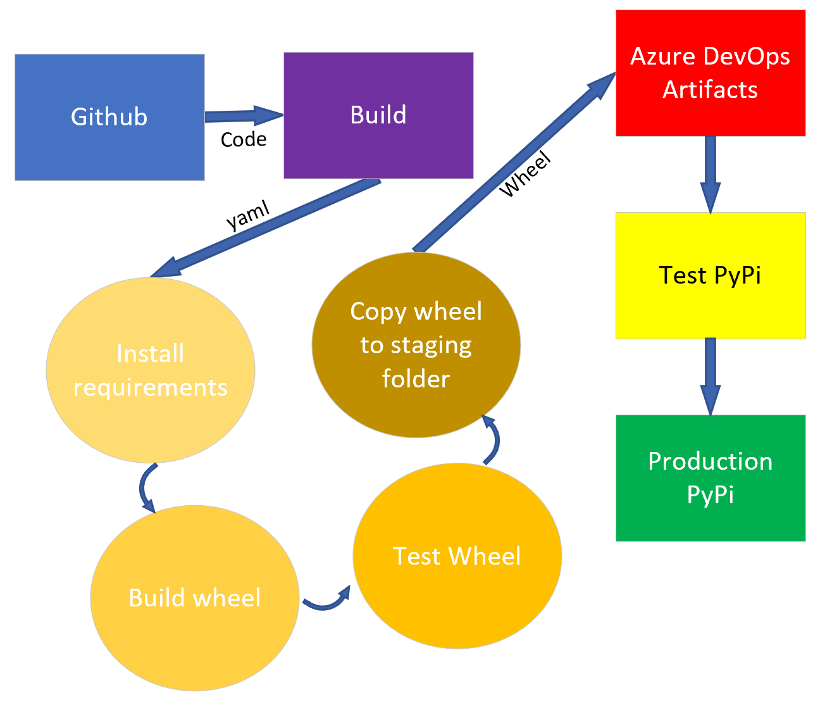

## Application Structure
There are three main activities that this application performs:

1. Process the input dataset
2. Train one or more models on the processed data to predict handwritten strokes
3. Generate (or smooth, which is a form of generation) handwritten text

Let's discuss each of these functions in turn, then put it all together.

### Data Processing
The input dataset is in the form of a set of XML files, each of which reflects the set of strokes belonging to a single sample of handwriting.  The samples come from the [IAM Online Database](https://fki.tic.heia-fr.ch/databases/iam-on-line-handwriting-database).  They were created by volunteers who wrote short phrases on an electronic device that captured the position of their pen in real time as they wrote.  Each point thusly captured has an x and y coordinate as well as a time stamp.  For this project, the time is not used, but we do need the x,y pairs.  Here is a sample of one of the XML files:

```xml
<WhiteboardCaptureSession>
  <WhiteboardDescription>
    <SensorLocation corner="top_left"/>
    <DiagonallyOppositeCoords x="6512" y="1376"/>
    <VerticallyOppositeCoords x="966" y="1376"/>
    <HorizontallyOppositeCoords x="6512" y="787"/>
  </WhiteboardDescription>
  <StrokeSet>
    <Stroke colour="black" start_time="769.05" end_time="769.64">
      <Point x="1073" y="1058" time="769.05"/>
      <Point x="1072" y="1085" time="769.07"/>
      ...
      <Point x="1215" y="1353" time="769.63"/>
      <Point x="1204" y="1330" time="769.64"/>
    </Stroke>
    <Stroke colour="black" start_time="769.70" end_time="769.90">
      <Point x="1176" y="1237" time="769.70"/>
      <Point x="1175" y="1233" time="769.72"/>
      ...
      <Point x="1010" y="1239" time="769.88"/>
      <Point x="1014" y="1243" time="769.90"/>
    </Stroke>
    ...
  </StrokeSet>
</WhiteboardCaptureSession>
```

And here is a sample of the file structure of the dataset and the meanings behind the naming scheme:

```powershell
├───ascii-all
│   └───ascii       # Text representation of each sample
│       ├───a01     # Participant identifier
│       │   ├───a01-000     # Text sample number
│       │   │       a01-000u.txt    # Text sample
│       │   │       a01-000x.txt
│       │   │
│       │   ├───a01-001     # <Participant#>-<Sample#>
│       │   │       a01-001w.txt
│       │   │       a01-001z.txt
│       ...
├───lineImages-all
│   └───lineImages  # Raster image of each sample
│       ├───a01
│       │   ├───a01-000
│       │   │       a01-000u-01.tif     # Raster image for a single line
│       │   │       a01-000u-02.tif     # <Part#>-<Sample#>-<Line#>
│       │   │       a01-000u-03.tif
│       │   │       a01-000u-04.tif
│       │   │       a01-000u-05.tif
│       │   │       a01-000u-06.tif
│       │   │       a01-000x-00.tif
│       │   │       a01-000x-01.tif
│       │   │       a01-000x-02.tif
│       │   │       a01-000x-03.tif
│       │   │       a01-000x-04.tif
│       ...
├───lineStrokes-all
│   └───lineStrokes # Sample handwriting in online format (IAM)
│       ├───a01
│       │   ├───a01-000
│       │   │       a01-000u-01.xml     # Online format sample for a single line
│       │   │       a01-000u-02.xml     # <Part#>-<Sample#>-<Line#>
│       │   │       a01-000u-03.xml
│       │   │       a01-000u-04.xml
│       │   │       a01-000u-05.xml
│       │   │       a01-000u-06.xml
│       │   │
│       ...
```

After studying the dataset and also considering the needs of the training process (described below), a simple cascading series of one-to-many relationships emerges as the obvious data modeling choice.  To reflect this structure in the application, a series of three objects is used.  One *Dataset* object represents the entire training dataset and can be reused later to represent smoothing samples and such in a consistent way.  Each *Dataset* contains a list of stroke sets (*StrokeSet*), where one stroke set represents the entirety of a single handwriting sample written by a volunteer, as shown:


Each stroke set then contains multiple strokes, stored as a list of *Stroke* objects.  A stroke is the set of points drawn between the time that the pen is set to the surface and lifted up again.  Finally, each stroke contains a list of points.  Conceptually, each point should be thought of as a fourth class (i.e. *Point*) in this hierarchy even though, for practical and performance reasons, the points are simply stored as x, y tuples in the stroke object.  The entire conceptual structure of the application is expressed in this UML class diagram:

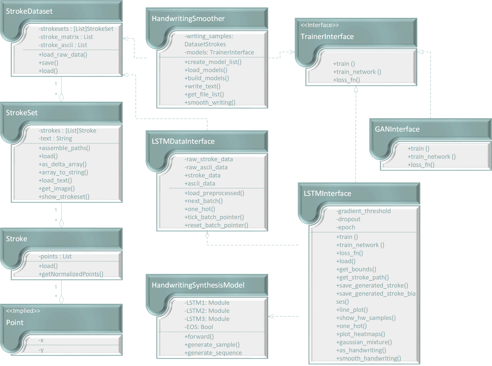

Here, then, is the complete picture of how the data in the input dataset corresponds to its in-memory representation.


### Model Training
The second major functional area is that of training any models that are used.  The specifics are training certain types are models are described later on.  For now, it's good to understand that the application will support any number of models, which could be useful to compare the accuracy and performance of various approaches to the handwriting generation problem, for example.

In order to make use of this mechanism, simply implement the *TrainerInterface* class, which requires methods to support training and a loss function along with methods to generate and smooth handwriting at a minimum.   Models can also load themselves from a saved Pytorch model file if they were previously saved, and this can be a tremendous time-saver since the training of machine learning models can require a significant investment of compute and time.

Once trained or loaded, the trained, ready-to-use models are available to the main program as a simple list of models.  They can then be used individually or processed collectively using polymorphism.  In this application, the only implemented model is currently *LSTMTrainer*.  *GANTrainer* is provided as a placeholder for development testing purposes and still requires implementation.  The *HandwritingSynthesisModel* is a custom implementation of a Pytorch *nn.Module* model and is used by the *LSTMTrainer*.

### Handwriting Generation
The final functional area of the program is that of handwriting generation.  This takes two forms.  In the first, a text string is provided (with a limit of 80 characters), and the trained model is then used to generate a sample of handwriting.  Legibility can be controlled with the *bias* parameter, where higher values (up to 10 or so) will result in greater readability, and low values (to a minimum of 0) give greater variety at the expense of legibility.  The resulting generated writing is saved in SVG format to the file name provided in the options.

The other function is to smooth handwriting.  For this, a sample of handwriting needs to be provided using the appropriate option.  The sample needs to be in the same format as the IAM dataset that was used to train the model(s).  Bias values control the legibility as described, and the generated handwriting is also saved as an SVG file.  In addition, a plot of the sample in a variety of biases is saved for further study on the effects of bias to the generation.

### Application Workflows
These three areas are combined below.  The dataset is read and processed into its internal object format.  Any defined models are then trained.  Finally, handwriting generation or smoothing is performed on the trained model(s).

## Training the Network
Now let's explore the training mechanism in greater detail.  In the main program, each model's *train()* method is invoked.  The *train()* method needs to take a *Datset* object as its input and uses that data to train an appropriate model.  

In the first implementation, this model is an LSTM network, which is implemented by the *LSTMTrainer* class.  LSTM is a type of neural network, so *train()* instantiates a new Pytorch model (in this case, *HandwritingSynthesisModel*) and calls *train_network()* to do the work of actually training that model, where most of the training work takes place.

There, training is broken into a series of *epochs*, which is then further broken into a series of *batches*.  Each batch represents a randomly selected subset of the entire training dataset, and each epoch is one full training of all of its batches exactly once.  You can control the number of epochs with the *--epoch* option.  As you might expect, more epochs will result in better training but at the cost of more training time and computation.  For this example, 30 epochs were used for the training.

The training algorithm uses an Adam optimizer with a learning rate of 0.005. The gradients are clipped inside [-gradient_threshold, gradient_treshold] to avoid exploding gradients.

The model is saved after each epoch.  This not only makes the model available later without the need to retrain; it also guards against unexpected interruption of the training process so that we don't have to start over completely.

As the training proceeds, information of interest is saved, such as the loss for epochs and batches.  This information is then plotted at the end of the training.  In addition, heat maps similar to those in the paper are plotted every 100 batches.

The heart of the whole algorithm happens when we call *forward()* on the custom LSTM model, which returns the information that we need to calculate the Gaussian mixture probabilities.  Once computed, that probability is then fed into the loss function.  These 3 steps are repeated for every batch/epoch.

Here is the code conceptually:

```python
def train_network(self, model, train_strokeset, model_save_loc, epochs = 5, generate = True):
    data_loader = LSTMDataInterface(train_strokeset, self.n_batch, self.sequence_length, 20, U_items=self.U_items) # 20 = datascale
    
    optimizer = optim.Adam(model.parameters(), lr=0.005)
    
    # A sequence the model is going to try to write as it learns
    c0 = np.float32(self.one_hot("Handwriting sample"))
    
    # Loop over epochs
    for epoch in range(epochs):
        data_loader.reset_batch_pointer()
        
        # Loop over batches
        for batch in range(data_loader.num_batches):
            # Loading a batch (x : stroke sequences, y : same as x but shifted 1 timestep, c : one-hot encoded character sequence ofx)
            x, y, s, c = data_loader.next_batch()

            x = torch.from_numpy(x).permute(1, 0, 2) # torch.Size([self.sequence_length, self.n_batch, 3])
            y = torch.from_numpy(y).permute(1, 0, 2) # torch.Size([self.sequence_length, self.n_batch, 3])
            c = torch.from_numpy(c) # torch.Size(self.n_batch, self.U_items, len(alphabet))
            
            # Forward pass
            es, pis, mu1s, mu2s, sigma1s, sigma2s, rhos = model.forward(x, c)
            
            # Calculate probability density and loss
            Pr = self.gaussian_mixture(y, pis, mu1s, mu2s, sigma1s, sigma2s, rhos)
            loss = self.loss_fn(Pr,y, es)
            
            # Back propagation
            optimizer.zero_grad()
            loss.backward()
            
            # Gradient clipping
            torch.nn.utils.clip_grad_norm_(model.parameters(), self.gradient_threshold)
            optimizer.step()
            
            # Useful infos over training
            if batch % 10 == 0:
                print f"Epoch : {epoch} - step {batch}/{data_loader.num_batches} - loss {loss.item():.3f} took {(time.time() - start):.2f} seconds"
                
                # Plot heatmaps every 100 batches
                if batch % 100 == 0:
                    self.plot_heatmaps(s[0], model.Phis.transpose(0, 1).detach().numpy(), model.Ws.transpose(0, 1).detach().numpy())
                    
                # Generate a sequence every 500 batches to watch as the training progresses   
                if generate and batch % 500 == 0 :
                    x0 = torch.Tensor([0,0,1]).view(1,1,3)
                    sequence = model.generate_sequence(x0, c0, bias = 10)
                    
            # Save loss per batch
            time_batch.append(epoch + batch / data_loader.num_batches)
            loss_batch.append(loss.item())
        
        # Save loss per epoch
        time_epoch.append(epoch + 1)
        loss_epoch.append(sum(loss_batch[epoch * data_loader.num_batches : (epoch + 1)*data_loader.num_batches-1]) / data_loader.num_batches)
        
        # Save model after each epoch
        torch.save(model.state_dict(), model_save_loc)
        
    return model
```

  
### Computational Considerations
To help with the computational costs, the program is written to  automatically take advantage of CUDA GPUs, if they are available.  In this example, CUDA training times were around 15-20% of their times without it (i.e. using only the CPU), which is about an 85% speedup on average.

### Visualizing the Training
The training process also has a number of "hooks" that allow you to see what is going on visually.  Each one is controlled by options (described in detail above).

The first hook is to simply show and/or save the each training sample as it is encountered.  While this can be helpful in a troubleshooting situation, be aware that this will generate a **lot** of output since the entire training set will ultimately be output multiplied by the number of epochs.


The second hook will save heatmap plots of the training progress every 100 batches.  These heat maps represent the training Phis (more below) and soft attention windows at that point in the training.  They are useful for understanding the math behind the training, for making sure training is proceeding as expected, and for selectively including in other publications like papers or reports.

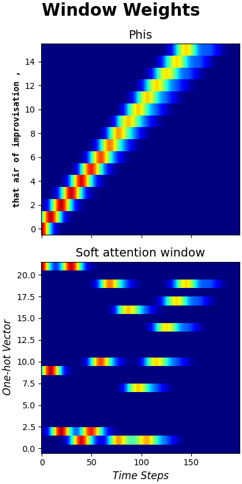

The third hook generates a sample handwriting sequence every 500 batches.  This is useful to see how the training is progressing and to understand what the model is doing at certain points in its execution.

Then, a fourth hook will trigger at the end of the training operation if the *--test-model* flag is set.  This will generate a final set of handwriting images in SVG format to validate the state of the trained model.

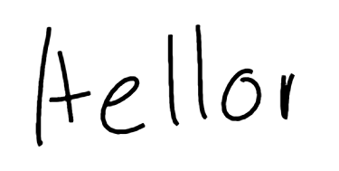

At the end of training, a plot of the loss by epoch is saved.  This is useful to see the progress and effectiveness of the training.

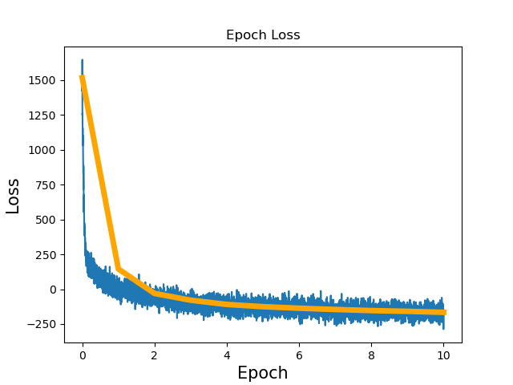

Finally, additional telemetry is instrumented throughout the application to monitor training since this is an important activity that can be hard to troubleshoot in the event of issues.  Progress is periodically shown on the command line as the program runs, which should reassure a user that the application is working and not locked up.  Command line output, however, is limited to avoid a massive (and therefore noisy) output of information.  Thus, a logging system is in place to capture a tremendous amount of information as the program runs.  This is useful for several purposes.  First, studying the logs and correlating log entries with code points during execution is a superb way to understand the code for pedagogical purposes, and this method is much faster than actually running the code and observing, for instance, in a debugger because you never have to wait for execution to complete (because it is already done!).  Second, the logging reveals a tremendous amount of internal execution information, which can be used for diagnostics and debugging, especially if logging is set to the *debug* level of severity.

```log
28-Jan-21 21:10:41 DEBUG (HandwritingSmoother.py/main:79): Starting app
28-Jan-21 21:10:41 INFO (HandwritingSmoother.py/create_model_list:225): Using model: LSTM
28-Jan-21 21:10:41 DEBUG (LSTMTrainer.py/__init__:85): In ltsm con
28-Jan-21 21:10:41 INFO (LSTMTrainer.py/__init__:105): Using CUDA
28-Jan-21 21:10:41 INFO (LSTMTrainer.py/load:150): Loading previously saved model file: .\saves\hwSynthesis.model
28-Jan-21 21:10:41 DEBUG (StrokeDataset.py/init:28): Init
28-Jan-21 21:10:41 DEBUG (StrokeDataset.py/load_raw_data:64): Loading dataset ['C:\\Code\\SMU\\Capstone\\Data\\IAM Original\\lineStrokes-all\\lineStrokes\\a01\\a01-000\\a01-000u-01.xml']
28-Jan-21 21:10:41 DEBUG (StrokeSet.py/__init__:50): Loader constructor
28-Jan-21 21:10:41 DEBUG (StrokeSet.py/init:32): Init
28-Jan-21 21:10:41 DEBUG (StrokeSet.py/assemble_paths:65): Assembling pathnames for C:\Code\SMU\Capstone\Data\IAM Original\lineStrokes-all\lineStrokes\a01\a01-000\a01-000u-01.xml
28-Jan-21 21:10:41 DEBUG (StrokeSet.py/load_text:230): Corresponding text: A MOVE to stop Mr . Gaitskell
28-Jan-21 21:10:41 DEBUG (StrokeSet.py/assemble_paths:96): Folder: linestrokes-all\linestrokes
28-Jan-21 21:42:16 INFO (LSTMTrainer.py/load:150): Loading previously saved model file: .\saves\hwSynthesis.model
28-Jan-21 21:42:16 INFO (HandwritingSmoother.py/main:146): Testing model
28-Jan-21 21:42:16 INFO (LSTMTrainer.py/as_handwriting:712): Generating handwriting from text "Sample text"
28-Jan-21 21:42:16 DEBUG (LSTMTrainer.py/one_hot:325): One hotting: Sample text
28-Jan-21 21:42:19 INFO (HandwritingSynthesisModel.py/generate_sequence:411): Generating sample stroke sequence ...
```

## Understanding the Network
Now let's focus on the theory and math behind the LSTM network and why is works.

*LSTM* is short for *Long short-term memory*.  Intuitively, this means that the network has a built-in "memory".  This is important for something like handwriting generation because future points along a stroke depend not just on the immediate predecessor to the stroke but also on several predecessors.  For instance, to draw an *S*, this requires a series of points along the curve of the *S*.  You need to know that you are writing an *S* as opposed to another character like a *C* or even as opposed to a random sequence of points that makes no letter at all.

LSTM is a specialized form of an *RNN* or *Recurrent Neural Network*.  As such, any considerations for RNN will also apply to LSTM.  RNNs in particular suffer from a phenomenon known as the *vanishing gradient problem*, and LSTMs address this.  Gradients are those from mathematics, and they can "vanish" in a regular RNN because the network performs a multiplication at each iteration of training.  Those stacked multiplications are the same, mathematically, as exponentiation, and exponentiation is an inherently unstable operation.  Therefore, with each new multiplication the exponent grows.  As the exponent grows very large, an operand less than one will grow very small and approach zero... thus, it "vanishes" over time.  LSTMs solve this by basically replacing the multiplication with addition.

### Structure of LSTM
Let's summarize the structure of an LSTM here, though the original Graves paper is highly recommended reading for full understanding.

To begin, let's look at the architecture of a regular RNN network.

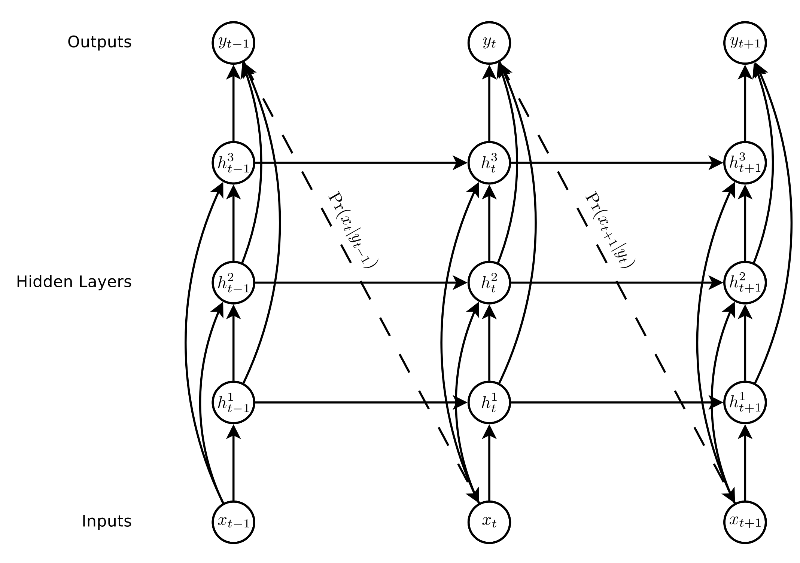

As with any neural network, the design consists of an input layer, an output layer, and a series of hidden layers in between. The *x* terms represent the location at points in time.  Those pass through the hidden layers to the output layer.  The output of a layer, which is a probability distribution of the next point, becomes the input to the next network iteration.  So the output of x_\{n-1\} becomes the input of x_\{n\}.

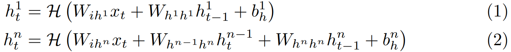

The hidden layer activations are calculated according to equations {1} (for the first hidden layer) and {2} (for the *n*th hidden layer) of the paper. The *W* terms are weight matrices.  In fact, most of the calculations will be done using linear algebra vectors and matrices for simplicity and performance.  The output is computed according to equation {3} and {4}.  

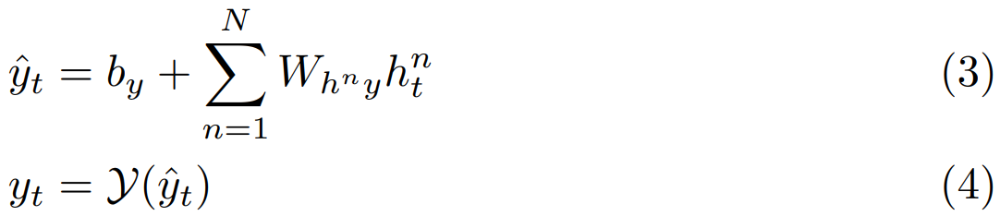

At each iteration, a loss function is needed in order to determine how well the iteration did and to make adjustments.  The loss function is given by equation {6}, which calculates partial derivatives and applies them via backpropagation to the network for use by the next iteration.  (For a superb and easy to follow presentation of how neural networks and backpropagation work, see [this](https://www.youtube.com/watch?v=aircAruvnKk)).

For an LSTM, we use a special cell for the hidden layer activation function.  The cell is a group of equations that interact with each other to compute the final value of the hidden layer h_\{t\}.  Then, of course, that becomes h_\{t-1\} when the cell is computed the next time through the network.  The diagram may seem complicated, but if you study it for just a moment, you will notice that *i*, *f*, *o*, and *c* correspond to each one of a function below, and *h*, also a function below, is computed from the others.  These functions represent equations 7 - 11 from the paper.

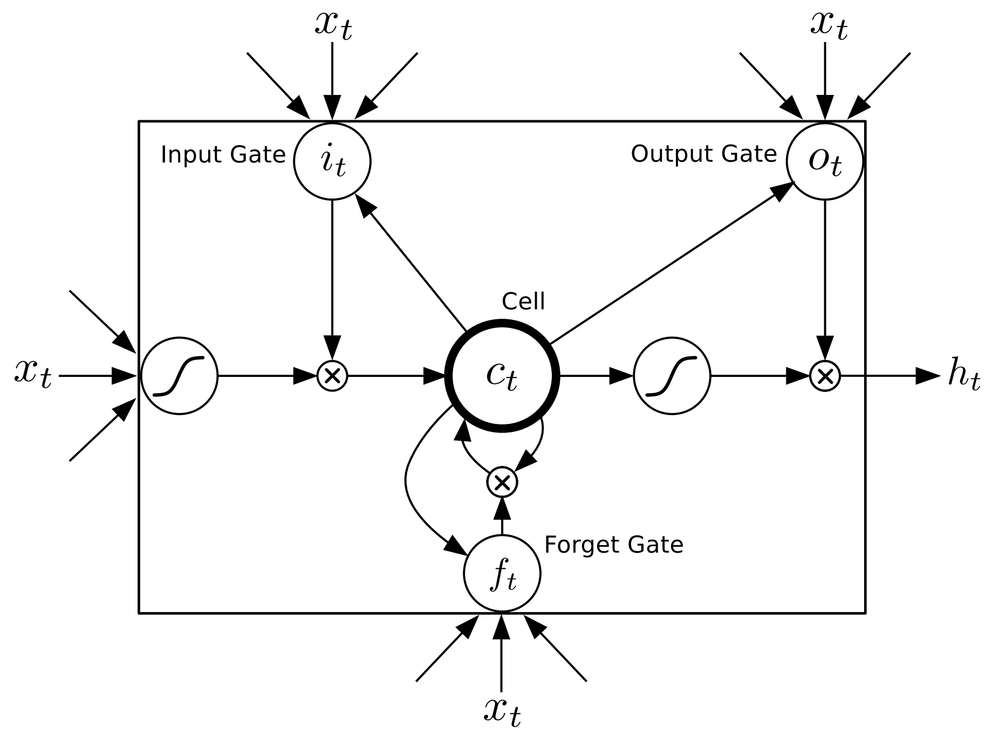

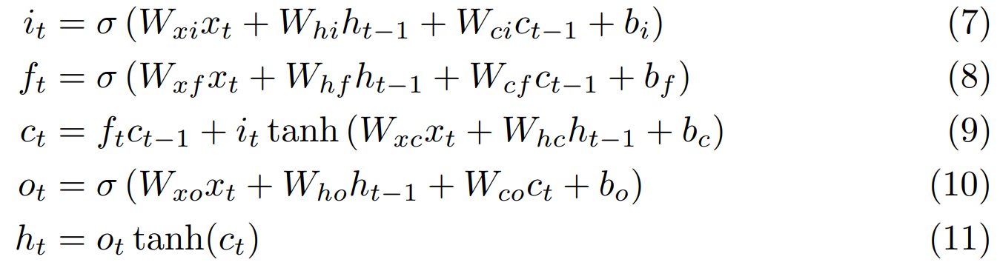

One thing to note at this point is that, because we are using the longer (additive) memory in an LSTM instead of the shorter (multiplicative) memory of an RNN, the vanishing gradient problem has, well, vanished.  However, in its place is a potential new problem: exploding gradients, which is the opposite problem as before.  Because of the unstable nature of exponentiation (the effect that comes into play over many iterations of the network training algorithm), the gradients (derivatives) computed at each iteration might expand to an exponentially large value.  Not to worry, though.. we have a solution, which is to simply "clip" the gradients so that they never exceed a certain value; in our case, they were clipped between -10 and 10.

To aid in understanding, here is another diagram of the same thing from [ResearchGate](https://www.researchgate.net/figure/One-cell-Long-Short-Term-Memory-RNN_fig2_338626035)


Look closely.  You'll see the same functions noted in the earlier memory cell diagram and in the equations above: *i*, *f*, *o*, and *c* along with the hidden output *h*.  Concretely, code implemented from this will compute each piece using the inputs as shown on the diagrams/formulas.  Then, those computed results will be used in subsequent computations as the calculation executes across the cell/layers.  Outputs from one iteration become inputs to the next, and the process repeats for all of the inputs in the current batch, then across all the batches in the epoch, then for each of the epoch in the training.

### Mixture Densities
This is a key part of handwriting generation.  In simple terms, the network computes a statistical probability function that represents the odds that the next point in the stroke will be at a certain position.  The distribution is normalized, which makes it easy to differentiate.  Let's use an example.  Say you are drawing an *S*.

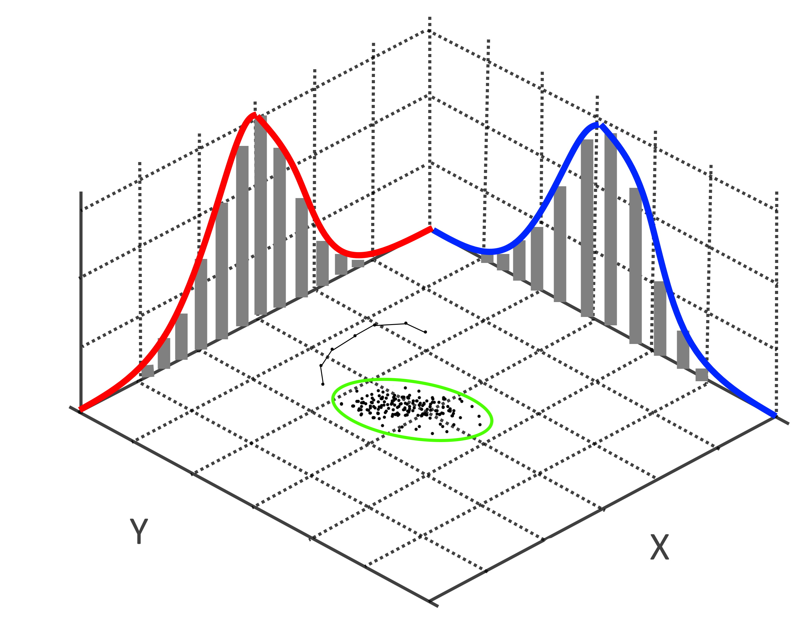

The current point is at the end of the series of connected points along the x/y axis.  Intuitively, you would expect the next likely point to be somewhere in an oval space around the current point.  Because it is an *S*, the distribution would be skewed a bit to the next part of the *S* stroke (because the network was trained, remember, so it generally knows how to draw an *S*).  Here is another visual diagram of what's going on here (minus the *S* strokes), courtesy of [Rafael Monteiro](https://stackoverflow.com/questions/19949435/3d-plot-of-bivariate-distribution-using-r-or-matlab):

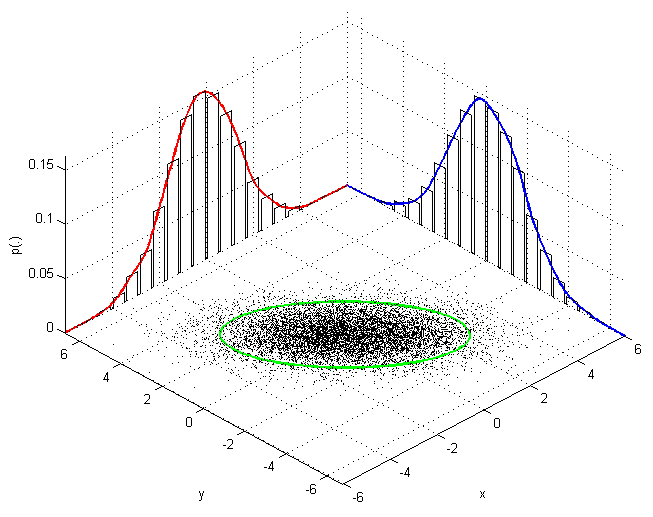

The oval represents the possible points, but notice that the oval is composed of two (i.e. the "bi" in bivariate) histograms, which are just the probabilities of x and of y.  Of course, there is a lot more going on with a Gaussian mixture mathematically, and this math is expressed by equations 23 - 25 in the Graves paper.

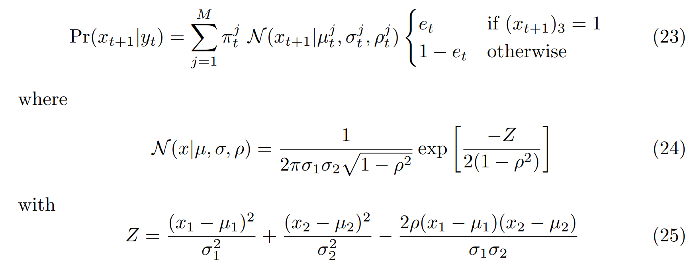

The paper also goes through the derivation of the loss function, which is in turn used to update the weights of the network in backpropagation, as usual.  The most likely point is then chosen from the distribution and used as the starting point of the next iteration.  The end point, which is the point at which the pen is lifted, is also computed, and this is how the network knows when to end one stroke and begin the next.

Compare the implementation of the Gaussian mixture to equations 23 - 25 above:

```python
def gaussian_mixture(self, y, pis, mu1s, mu2s, sigma1s, sigma2s, rhos):
    n_mixtures = pis.size(2)
    
    # Takes x1 and repeats it over the number of Gaussian mixtures
    x1 = y[:,:, 0].repeat(n_mixtures, 1, 1).permute(1, 2, 0) 
    
    # First term of Z (eq 25)
    x1norm = ((x1 - mu1s) ** 2) / (sigma1s ** 2 )  
    x2 = y[:,:, 1].repeat(n_mixtures, 1, 1).permute(1, 2, 0)  
    
    # Second term of Z (eq 25)
    x2norm = ((x2 - mu2s) ** 2) / (sigma2s ** 2 )
    
    # Third term of Z (eq 25)
    coxnorm = 2 * rhos * (x1 - mu1s) * (x2 - mu2s) / (sigma1s * sigma2s) 
    
    # Computing Z (eq 25)
    Z = x1norm + x2norm - coxnorm
    
    # Gaussian bivariate (eq 24)
    N = torch.exp(-Z / (2 * (1 - rhos ** 2))) / (2 * np.pi * sigma1s * sigma2s * (1 - rhos ** 2) ** 0.5) 
    
    # Pr is the result of eq 23 without the eos part
    Pr = pis * N 
    Pr = torch.sum(Pr, dim=2) 

    return Pr
```


### Handwriting Synthesis Model
The key method of the model implementation is *forward()*, which will be called repeatedly by the trainer.  This method represents the forward propagation. It takes x and c as inputs.

x is a batch of stroke coordinates of sequences. Its dimensions are [sequence_size, batch_size, 3]. The 3 corresponds to x and y offset of a stroke and eos (= 1 when reaching an end of stroke (when the pen is raised)).

c, a batch of one-hot encoded sentences corresponding to the stroke sequence is of dimensions [n_batch, U_items, len(alphabet)]. It is estimated that a letter corresponds to 25 points. U_items is the number of characters in the sequence. For example, if the sequence is 400 points long, U_items = 400 / 25 = 16 characters. len(alphabet) is the number of characters in our alphabet.

Note that the forward function is also used to generate random sequences.

The first step is to compute LSTM1. This is straightforward in PyTorch. Since the LSTM cells use Pytorch, we need a *for* loop over the whole stroke sequence.

After LSTM1, the code computes the attention mechanism given by equations 46-51 of the paper.

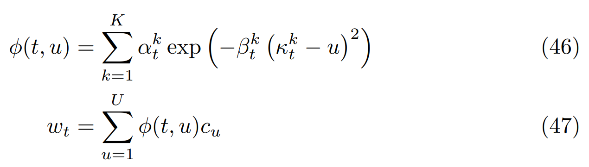


After that, the networks computes LSTM2 and LSTM3. Then it's just a matter of computing 18 - 22 of the paper using a dense layer.

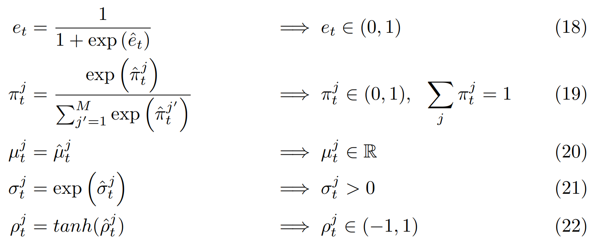

An interesting thing to note is that the algorithm will continue until it reaches the stopping condition, which is not as trivial as it might seem.  Since strokes will nearly always take a variable number of points to construct, it is not a simple matter of enumerating through a *for* loop.  Instead, the algorithm must compare the computed *phi* to the collection of previous *phi*s.  When the computed *phi* becomes greater than any other value, then the algorithm has reached the end of the sequence and can stop.

```python
def forward(self, x, c, generate = False):
    # Adapted from: https://github.com/adeboissiere/Handwriting-Prediction-and-Synthesis

    # Sequence length
    sequence_length = x.shape[0]
        
    # Number of batches
    n_batch = x.shape[1]
        
    # Soft window vector w at t-1
    w_t_1 = torch.ones(n_batch, self.alphabet_size) # torch.Size([n_batch, len(alphabet)])
        
    # Hidden and cell state for LSTM1
    h1_t = torch.zeros(n_batch, self.hidden_size1) # torch.Size([n_batch, hidden_size1])
    c1_t = torch.zeros(n_batch, self.hidden_size1) # torch.Size([n_batch, hidden_size1])
        
    # Kappa at t-1
    kappa_t_1 = torch.zeros(n_batch, self.Kmixtures) # torch.Size([n_batch, Kmixtures])
        
    # Hidden and cell state for LSTM2
    h2_t = torch.zeros(n_batch, self.hidden_size2) # torch.Size([n_batch, hidden_size2])
    c2_t = torch.zeros(n_batch, self.hidden_size2) # torch.Size([n_batch, hidden_size2])
        
    # Hidden and cell state for LSTM3
    h3_t = torch.zeros(n_batch, self.hidden_size3) # torch.Size([n_batch, hidden_size3])
    c3_t = torch.zeros(n_batch, self.hidden_size3) # torch.Size([n_batch, hidden_size3])
            
    for i in range(sequence_length):
        # ===== Computing 1st layer =====
        input_lstm1 = torch.cat((x[i], w_t_1), 1) # torch.Size([n_batch, input_size1])
        h1_t, c1_t = self.lstm1(input_lstm1, (h1_t, c1_t)) # torch.Size([n_batch, hidden_size1])
            
        # ===== Computing soft window =====
        window = self.window_layer(h1_t)
            
        # Splits exp(window) into 3 tensors of torch.Size([n_batch, Kmixtures])
        # Eqs 48-51 of the paper
        alpha_t, beta_t, kappa_t = torch.chunk( torch.exp(window), 3, dim=1) 
        kappa_t = 0.1 * kappa_t + kappa_t_1
            
        # Updates kappa_t_1 for next iteration
        kappa_t_1 = kappa_t
            
        u = torch.arange(0,c.shape[1], out=kappa_t.new()).view(-1,1,1) # torch.Size([U_items, 1, 1])
            
        # Computing Phi(t, u)
        # Eq 46 of the paper
        # Keep in mind the (kappa_t - u).shape is torch.Size([U_items, n_batch, Kmixtures])
        # For example :
        ## (kappa_t - u)[0, 0, :] gives kappa_t[0, :]
        ## (kappa_t - u)[1, 0, :] gives kappa_t[0, :] - 1
        ## etc
        Phi = alpha_t * torch.exp(- beta_t * (kappa_t - u) ** 2) # torch.Size([U_items, n_batch, Kmixtures])
        Phi = torch.sum(Phi, dim = 2) # torch.Size([U_items, n_batch]) 
        if Phi[-1] > torch.max(Phi[:-1]):
            self.EOS = True     # This is how we know when to stop predicting stroke points
        Phi = torch.unsqueeze(Phi, 0) # torch.Size([1, U_items, n_batch])
        Phi = Phi.permute(2, 0, 1) # torch.Size([n_batch, 1, U_items])
            
        # Computing wt 
        # Eq 47 of the paper
        w_t = torch.matmul(Phi, c) # torch.Size([n_batch, 1, len(alphabet)])
        w_t = torch.squeeze(w_t, 1) # torch.Size([n_batch, len(alphabet)])  
        self.Ws[i, :] = w_t[0, :] # To plot heatmaps
            
        # Update w_t_1 for next iteration
        w_t_1 = w_t
            
        # ===== Computing 2nd layer =====
        input_lstm2 = torch.cat((x[i], w_t, h1_t), 1) # torch.Size([n_batch, 3 + alphabet_size + hidden_size1])
        h2_t, c2_t = self.lstm2(input_lstm2, (h2_t, c2_t)) 
            
        # ===== Computing 3rd layer =====
        input_lstm3 = torch.cat((x[i], w_t, h2_t), 1) # torch.Size([n_batch, 3 + alphabet_size + hidden_size2])
        h3_t, c3_t = self.lstm3(input_lstm3, (h3_t, c3_t))
        out[i, :, :] = h3_t
            
    # ===== Computing MDN =====
    es = self.z_e(out)
    es = 1 / (1 + torch.exp(es))
    pis = self.z_pi(out) * (1 + self.bias)
    pis = torch.softmax(pis, 2)
    mu1s = self.z_mu1(out) 
    mu2s = self.z_mu2(out)
    sigma1s = self.z_sigma1(out)
    sigma2s = self.z_sigma2(out)
    sigma1s = torch.exp(sigma1s - self.bias)
    sigma2s = torch.exp(sigma2s - self.bias)
    rhos = self.z_rho(out)
    rhos = torch.tanh(rhos)
    es = es.squeeze(2) 
        
    return es, pis, mu1s, mu2s, sigma1s, sigma2s, rhos
```

Another important method of this class is the sequence generator, which utilizes the *forward()* method to generate a sequence of stroke points for generation.  More detail is below in the discussion of generation.

### Training the Network
Now let's make the theory concrete.  First, the same configuration is used as in the Graves paper.  The input layer is size 3, and there are 3 hidden layers with 400 cells in each one.  The output layer has 20 bivariate Gaussian mixture components.  The loss function uses stochastic gradient descent.  Once trained, the same configuration is used to generate or smooth handwriting.

Going back to the implementation of *LSTMTrainer*, the *train_network()* method first calls the *forward()* method of the *HandwritingSynthesisModel*, which is a standard method implemented as specified by Pytorch.  This method automatically computes the gradient weight updates to the network.  

The *forward()* gives us the values that we need in order to compute the Gaussian mixture (eqs. 23 - 25), namely *y*, *pi*, both *mu*s, both *sigma*s, and *rho*.  These become the input to the *gaussian_mixture()* method, which returns the computed probability of the next *x* given *y*.

Finally, once we have the predicted value, the algorithm compares it to the actual value from the training data using the *loss_fn()*.  The result is used to propagate backward through the network and update the weights.  The gradients are clipped as described above at this point, too.  After every epoch, the state of the model is saved so it can be reloaded later to save time.

```python
def loss_fn(self, Pr, y, es):
    # Adapted from: https://github.com/adeboissiere/Handwriting-Prediction-and-Synthesis

    loss1 = - torch.log(Pr + self.eps) # -> torch.Size([self.sequence_length, batch])    
    bernoulli = torch.zeros_like(es) # -> torch.Size([self.sequence_length, batch])
    bernoulli = y[:, :, 2] * es + (1 - y[:, :, 2]) * (1 - es)
    
    loss2 = - torch.log(bernoulli + self.eps)
    loss = loss1 + loss2 
    loss = torch.sum(loss, 0) 
    
    return torch.mean(loss);
```

## Generating Handwriting
With the trained network in hand, the next step is to generate sequences of stroke points that, together, will form the generated sample.  A key consideration is that, in order to generate a handwriting sample, we need to know how to write individual letters.  The strokes are trained, of course, but how do we tell the network to generate the particular letters of a text string?

The answer is a slight modification to the network architecture:

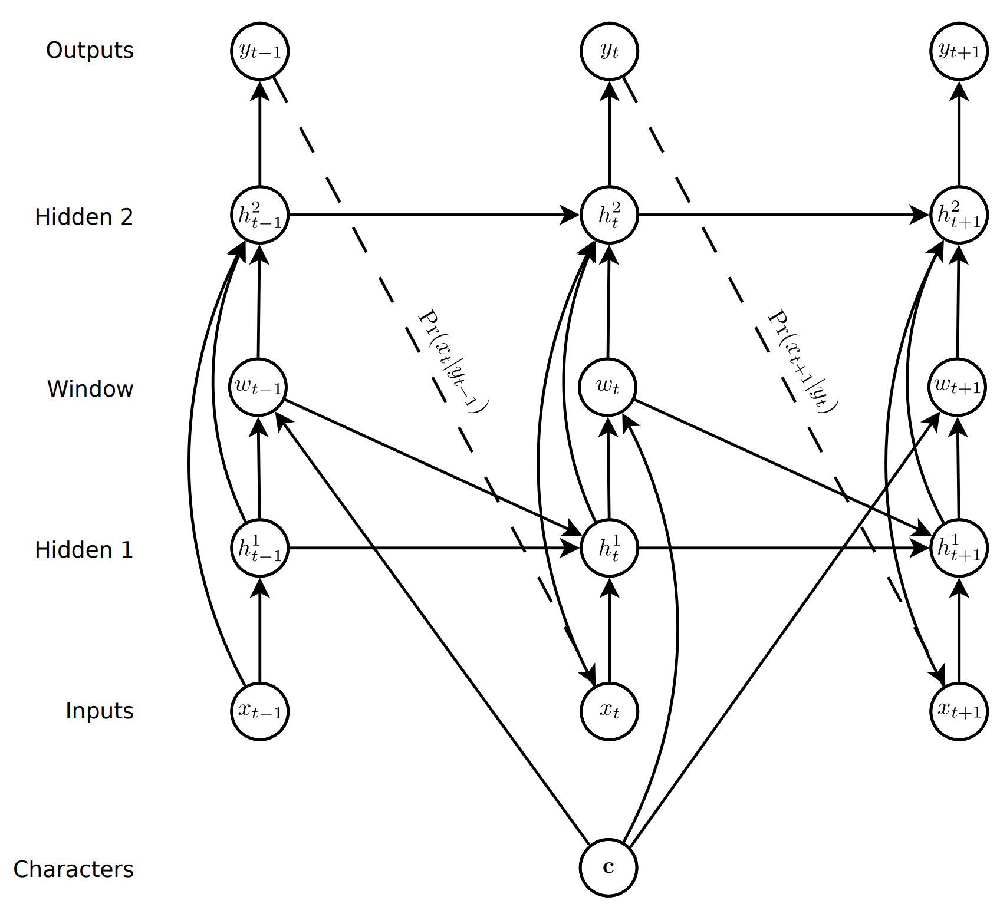

If you study the diagram carefully, you'll notice that there are two new elements.  First, the character *c* is specified prior to the input layer.  This character is then inserted in between the hidden layers as a one-hot-encoded vector.  The computation of the network then proceeds as normal.  As described previously, the *phi*s are examined to determine the stopping condition: φ(t, U + 1) > φ(t, u) ∀ 1 ≤ u ≤ U

The resulting style is consistent within itself but distinct from other sequences.  In other words, a generated sequence will have the same handwriting style for the entire sequence.  However, generating the sequence again, with the same or different character input, will result in a different handwriting style.

In the code, the method *as_handwriting()* is used to generate the handwriting sequence and to optionally display/save it according to the options that have been set.

```python
def as_handwriting(self, text, bias = 10, show_biases = False):
    # c is the text to generate
    c0 = np.float32(self.one_hot(text))

    # Starting sample (initially empty)
    x0 = torch.Tensor([0,0,1]).view(1,1,3)

    # Ask the trained model to generate the stroke sequence
    if show_biases:
        biases = [0., .1, .5, 2, 5, 10]
        sequences = []

        for bias in biases:
            sequences.append(self.trained_model.generate_sequence(x0, c0, bias))
            
        self.save_generated_stroke_biases(sequences, factor = 0.5, biases = biases)
    else:
        sequence = self.trained_model.generate_sequence(x0, c0, bias)
        self.save_generated_stroke(sequence, factor=0.5, show_save_loc = True)
```

## Smoothing Handwriting
Smoothing is very similar to generation.  The key difference is that, instead of relying on a text string, the generator takes a sample of existing handwriting.  The sample is input to the generation sequence to *prime* the sequence.  This gives the LSTM network a history of data points from which it will predict the next set of points.  That lets it maintain the same style as the source handwriting.

So how do we improve the handwriting?  The answer lies in adding a bias term to the Gaussian mixture equations, as shown in equations 61 and 62 of Graves.  This effectively reduces the variation in point prediction and therefore maintains the style.

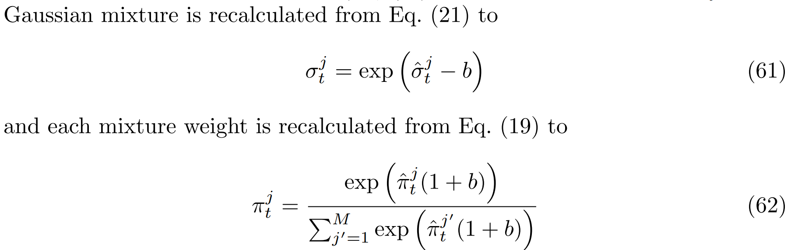

Lower biases tend to have less effect on the stylistic improvement, whereas higher biases result in cleaner handwriting at a cost of reduced stylistic distinctness.  Practically, values closer to 0 had the least effect and closer to 10 had the greatest effect.

In the code, the method *smooth_handwriting()* is used to smooth the supplied handwriting sequence and to optionally display/save it according to the options that have been set.  The sequence is provided in a data file of the same format online format as the training dataset.  Internally, the sample is simply an instantiation of the *Dataset* class described previously.

```python
def smooth_handwriting(self, sample, bias = 10, show_biases = False):
    sample = LSTMDataInterface(sample)

    # c is the text to generate
    text = sample.ascii_data[0]
    c0 = np.float32(self.one_hot(' '*len(text) + text))

    # Starting sample
    x0 = torch.Tensor([0,0,1]).view(1,1,3)
    prime0 = self.build_priming_sequence(x0, sample.stroke_data[0])

    # Ask the trained model to generate the stroke sequence
    if show_biases:
        biases = [0., .1, .5, 2, 5, 10]
        sequences = []

        for bias in biases:
            sequences.append(self.trained_model.generate_sequence(x0, c0, bias, prime0))
            
        self.save_generated_stroke_biases(sequences, factor = 0.5, biases = biases)
    else:
        sequence = self.trained_model.generate_sequence(x0, c0, bias, prime0)
        self.save_generated_stroke(sequence, factor=0.5, show_save_loc = True)
```

## Future Directions
In the course of exploring techniques for this project, we ran across a lot of information about *GAN*s, or *Generative Adversarial Networks*.  It would be interesting to explore using *GAN*s to replicate the generative and smoothing work presented here.  We believe such a network could be utilized to convert handwriting from an image into the online *x, y* format needed for smoothing.  It would also be interesting to find a way to minimize stylistic variance when using the bias adjustment technique while still improving the legibility.

## Author
This project description and source code was written by Edward Fry, except where otherwise noted.